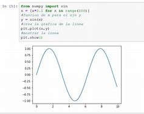
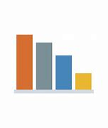
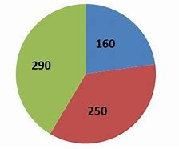

# Graficos con Phyton 

.

Para la creación de un gráfico interactivos se ha de crear un Notebook en el que se ha de incluir las siguientes líneas. Una vez realizado esto se ha de crear una función que genere el gráfico deseada. 

## Grafico de Barras

Para mostrar un diagrama de barras, deberá utilizar el método **bar () .**

```
 import matplotlib.pyplot as plt
 x=[3,4,5,6,7,8,9,10,11,12]
 y= [9,16,25,36,49,64,81,100,121,144]
 plt.bar(x,y)
 plt.show()
```
.

## Grafico Circular

Un gráfico circular es un poco diferente del resto anterior. La línea 4 es de particular interés, así que eche un vistazo a las características allí.

```{tip}
**figsize** se utiliza para establecer la relación de aspecto. Puede configurarlo como desee *(por ejemplo, (9,5))*, pero los documentos oficiales de Pandas aconsejan que utilice una relación de aspecto de 1.
```

```
 import matplotlib.pyplot as plt
 x=[4,9,16,25,36]
 fig = plt.figure(figsize =(9, 5)) # line 4
 plt.pie(x)
 plt.show()
```
.

 Puedes probrar en tu [JupyterLab](https://jupyter.org/try) en tu navegador.

 ```{seealso}
Instala [JupyterLab](https://jupyter.org/install), que tambien te permite escribir blocs de notas.
```

```{tip}
Puede ejecutar el comando `help ()`en su cuaderno para obtener asistencia interactiva sobre los comandos de Jupyter. Para obtener más información sobre un objeto en particular, puede usar **ayuda (objeto) .**
```